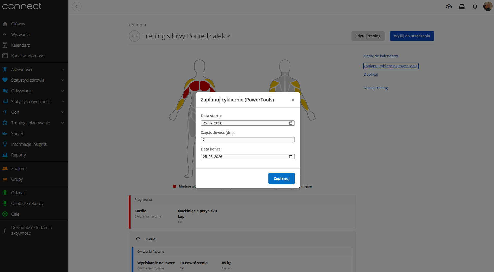
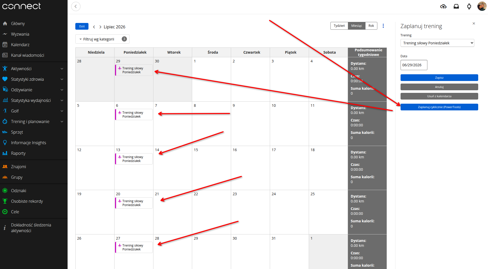

# G-Connect-PowerTools 🏃‍♂️⌚

A browser extension (Chrome/Edge/Brave) that adds the missing recurring workout scheduling feature directly from the workout editor in Garmin Connect Web.

## 🎯 Project Goal

By default, the Garmin Connect web interface only allows assigning a workout to a single, specific day from the details view. Scheduling the same strength workout for every Monday throughout the year requires tedious, manual clicking in the main calendar.

Following the **"Automation First"** approach, this extension automates the process. It injects a native-looking button into the UI (DOM) that triggers a script to generate a schedule and asynchronously send a series of requests to the Garmin API, automatically populating the calendar.

## 🚀 Features
* **UI Integration:** Seamlessly injects a "Recurring Schedule" button next to the native "Add to Calendar" button.
* **Bulk Scheduling:** Select a start date, interval (e.g., every 7 days), and an end date – the script calculates all iterations and sends the appropriate payloads.
* **Rate-limiting Awareness:** Built-in delay between requests to prevent triggering Garmin's API protection mechanisms (WAF) and getting blocked.

## 🛡️ Security & Architecture (Secure Code)

The project was designed with a strong emphasis on security and transparency. Installing extensions with access to private data requires a *Zero Trust* approach, which is why the architecture is based on the following principles:

* **No Data Exfiltration:** The extension runs 100% locally in an isolated browser context. The code does not communicate with any third-party servers (only `*.garmin.com`).
* **No Token Theft:** The script does not ask for a login, password, or export session tokens. It utilizes the user's native, authenticated session. `fetch` requests sent from the Garmin domain automatically include the required cookies (including HTTP-only).
* **Anti-CSRF Bypass:** The extension ensures the `NK: NT` header required by Garmin is injected into the HTTP headers, fully replicating a valid front-end request.
* **Transparent Code:** All logic is contained within just a few JS/TS files. The repository contains no minified or obfuscated code, allowing for a rapid **Secure Code Review** prior to installation.

## 🛠️ Installation (Developer Mode / PoC)

Currently, the extension is available for manual installation from source (unpacked).

1. Download the repository as a ZIP file and extract it (or run `git clone`).
2. In a Chromium-based browser (Chrome, Edge, Brave), navigate to: `chrome://extensions/`.
3. Enable **Developer mode** in the top right corner.
4. Click **Load unpacked** and select the folder containing the downloaded repository (the one with the `manifest.json` file).
5. Done! Log in to [Garmin Connect](https://connect.garmin.com) and open any saved workout.

## ⚙️ How it works under the hood

The extension listens for events in the dynamically loaded DOM tree (SPA) using `MutationObserver`. Upon detecting the workout details modal loading, the custom UI is injected.
The scheduling logic (Generator) relies on calculating dates and iteratively sending HTTP POST requests to the API endpoint:
`https://connect.garmin.com/workout-service/schedule/{WORKOUT_ID}`
with a JSON request body: `{"date": "YYYY-MM-DD"}`.

## 🤝 Contributing
Pull Requests are welcome. Areas for potential development:
* Extending logic to handle `409 Conflict` errors (skipping dates when a workout already exists there).
* Adding unit tests for the date generator (e.g., using a framework like Jest).
* Publishing the ready package to the Chrome Web Store.

## ⚠️ Disclaimer
This project is an independent Open Source tool (Proof of Concept) and is not authorized, developed, or supported by Garmin Ltd. Use at your own risk. Bypassing request delays too aggressively may result in temporary *rate limiting* applied to your account.